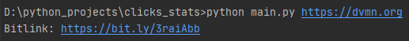
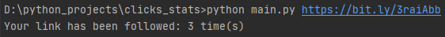

# Bitly url shorterer

The script shortens the user's link, converts it into a bitlink, counts the number of visitors' clicks on
the bitlink using the [Bitly service](https://bitly.com/).

### How to install

1. [Register on the Bitly website or log in to an existing account](https://bitly.com/a/sign_up?rd=%2Fjwt%2Fauthorize%3Freturn_to%3Dhttps%253A%252F%252Fsupport.bitly.com%252Fhc%252Fen-us%26client_id%3Dzendesk). 
2. Generate a key (OAuth access token) on the Bitly website according to [instructions](https://support.bitly.com/hc/en-us/articles/230647907-How-do-I-generate-an-OAuth-access-token-for-the-Bitly-API-): 
    * open **Profile menu**
    * open **Settings**
    * open **API**
    * Enter your Bitly account password
    * click **Generate token**
    * click **Copy** 

3.  Paste the copied key into the **.env** file as shown below:
```
BITLY_SECRET_TOKEN = "Bearer 628a636052d1715c158696e3652bf3f9bc93d308"
```

Python3 should be already installed. Then use pip (or pip3, if there is a conflict with Python2) to install dependencies:
```
pip install -r requirements.txt
```
### How to use
The following are examples of using the script.

* To get bitlink open a command prompt go to the directory with the script and enter:
```
python main.py https://dvmn.org
```
You should see a similar output from the script:



* To get the number of clicks:
```
python main.py https://bit.ly/3raiAbb
```
Output:



### Project Goals

The code is written for educational purposes on online-course for web-developers [dvmn.org](https://dvmn.org/).